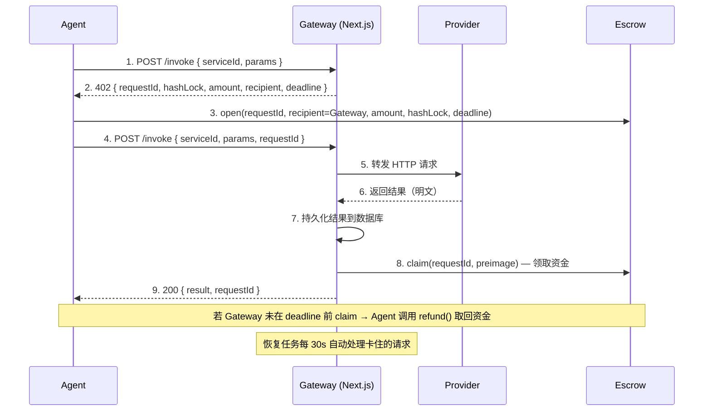

# NeuroStream

**Agent-native 付费与结算协议层。** 让 AI Agent 在运行时自动发现服务、通过 Payment Gateway 执行链上付费、获取服务结果——平台担保交付，Escrow 保障资金安全。

> NeuroStream 通过 Payment Gateway + Escrow 合约将资金释放与内容交付强绑定。Agent 付费即交付、不交付即退款。Provider 只需提供普通 HTTP API，零区块链集成门槛。

## 解决的问题

AI Agent 在运行时调用外部付费服务，传统支付流程依赖信任——付款后无法保证收到合法结果。NeuroStream 用 **Payment Gateway + 链上 Escrow** 替代信任：

- **Agent 保护** — 资金锁定在 Escrow 合约中，未交付则超时自动退款
- **Provider 保护** — 结果先持久化到数据库，再执行链上 claim，恢复任务自动重试
- **零门槛接入** — Provider 只需提供普通 HTTP API，无需钱包/私钥/区块链集成

## 协议流程（v3 — Gateway 架构）



**核心保障：**

- **Agent 不变量 (G1)** — 如果 Agent 锁定了资金，必须得到结果 **或者** 能在 deadline 后退款
- **Provider 不变量 (G2)** — 如果 Provider 返回了结果且已持久化，Provider 最终一定会被支付
- **状态机驱动** — 9 个状态、每步先写 DB 再执行外部操作、恢复任务自动推进卡住的请求

## 技术栈

| 层级 | 技术 | 用途 |
|------|------|------|
| 智能合约 | Solidity + Hardhat | Escrow（Hashlock/Timelock） |
| 目标链 | Monad Testnet | 10,000+ TPS，1 秒确定性 |
| Payment Gateway | Next.js API Route | 中转付费、调用 Provider、claim 领款、故障恢复 |
| SDK | TypeScript（Viem） | Agent 端一行代码调用服务 |
| 索引器 | viem + Supabase 轮询索引器 | 链上事件索引至 PostgreSQL |
| 后端 | Supabase（Edge Functions + PostgreSQL） | 服务注册、API Key、质量指标 |
| 前端 | Next.js + Privy + Wagmi + shadcn/ui | Provider 管理面板 & Agent 控制台 |

## 项目结构

```
packages/
  contracts/     Escrow 智能合约（Solidity + Hardhat，18 个测试）
  sdk/           TypeScript SDK，Agent 开发者使用（31 个测试）
  indexer/       viem + Supabase 链上事件轮询索引器（7 个测试）
apps/
  frontend/      Next.js DApp + Payment Gateway API Route
  provider/      Provider API 服务，纯 HTTP 接口（6 个测试）
  agent/         AI Agent CLI — Gemini + NeuroStream 自主付费对话
  backend/       Supabase Edge Functions + 数据库迁移
scripts/
  db-reset.ts    数据库重置脚本
  db-seed.ts     数据库种子数据脚本
  demo-agent.ts  Agent 演示脚本
docs/
  full-flow-test.md  全流程测试指南（v3 Gateway）
```

## 快速开始

### 前置条件

- **Node.js** >= 18
- **pnpm** >= 8.14

### 1. 安装依赖

```bash
git clone https://github.com/user/neuro-stream-demo.git
cd neuro-stream-demo
pnpm install
```

### 2. 部署合约（本地开发）

```bash
# 终端 1：启动本地 Hardhat 节点
cd packages/contracts && npx hardhat node

# 终端 2：部署 Escrow 合约
cd packages/contracts && npx hardhat run scripts/deploy.ts --network localhost
```

部署成功后会输出合约地址，例如 `0x5FbDB2315678afecb367f032d93F642f64180aa3`。

### 3. 配置环境变量

项目使用 `dotenv-cli -c` cascade 模式统一管理环境变量，加载顺序：

```
.env → .env.local → .env.<environment> → .env.<environment>.local
```

后加载的文件覆盖先加载的值。

| 文件 | 提交到 Git | 用途 |
|------|:----------:|------|
| `.env` | **是** | 共享非敏感默认值（端口号等） |
| `.env.development` | **是** | 开发环境默认值（本地 URL、测试地址） |
| `.env.production` | **是** | 生产环境模板（空占位符） |
| `.env.example` | **是** | 完整变量参考文档 |
| `.env.local` | 否 | 本地敏感信息（私钥、API Key） |

**快速开始：**

```bash
cp .env.example .env.local
```

将上一步获得的合约地址填入 `ESCROW_CONTRACT_ADDRESS`，其余变量按需填写：

| 变量 | 分类 | 必填 | 说明 |
|------|------|:----:|------|
| `ESCROW_CONTRACT_ADDRESS` | 区块链 | **是** | 已部署的 Escrow 合约地址 |
| `MONAD_RPC_URL` | 区块链 | 否 | RPC 地址（默认 `http://127.0.0.1:8545`） |
| `GATEWAY_PRIVATE_KEY` | Gateway | **是** | Gateway 钱包私钥（开发用 Hardhat Account #3） |
| `GATEWAY_WALLET_ADDRESS` | Gateway | **是** | Gateway 钱包地址 |
| `NEUROSTREAM_GATEWAY_URL` | Gateway | 否 | Gateway URL（默认 `http://localhost:3000`） |
| `NEUROSTREAM_API_URL` | SDK | 否 | Edge Functions 基地址 |
| `NEUROSTREAM_API_KEY` | SDK | 否 | API Key（从 Agent 面板生成） |
| `SUPABASE_URL` | 后端 | 否 | Supabase 项目 URL |
| `SUPABASE_ANON_KEY` | 后端 | 否 | Supabase 匿名密钥 |
| `SUPABASE_SERVICE_ROLE_KEY` | 后端 | 否 | Supabase Service Role 密钥 |
| `SUPABASE_DB_URL` | 后端 | 否 | PostgreSQL 连接串（迁移用） |
| `PRIVY_APP_ID` | 认证 | 否 | Privy 应用 ID |
| `PRIVY_APP_SECRET` | 认证 | 否 | Privy 应用密钥 |
| `GEMINI_API_KEY` | Agent | 否 | Google Gemini API Key |

### 4. 启动开发服务

```bash
# 确保 Hardhat 节点仍在运行，然后启动所有服务
pnpm dev
```

### 常用命令

```bash
pnpm dev          # 启动所有服务（Turborepo）
pnpm test         # 运行全部测试（共 62 个）
pnpm build        # 构建所有包
pnpm db:reset     # 重置 Supabase 数据库
pnpm db:migrate   # 执行 Supabase 数据库迁移
```

## SDK 使用示例

```typescript
import { NeuroStream } from '@neurostream/sdk';

// v3 Gateway 模式（推荐）
const client = new NeuroStream({
  apiKey: 'ns_live_xxxx',          // 平台注册后获取
  privateKey: '0x...',             // Privy 导出的钱包私钥
  gatewayUrl: 'http://localhost:3000', // Gateway URL
});

// 一行代码调用服务（自动发现 + Gateway 付费 + 获取结果）
const { result } = await client.callService({
  keyword: 'text-analysis',
  params: { text: 'Hello world' },
});

// 指定 serviceId 调用
const { result: r2 } = await client.callService({
  serviceId: 'text-analysis-v1',
  params: { text: 'Hello world' },
});
```

**Gateway 模式流程**：SDK 自动编排 POST invoke → 402 挑战 → Escrow 锁款 → POST invoke（带 requestId）→ Gateway 调用 Provider → claim → 返回明文结果。

**Legacy 模式**：不设置 `gatewayUrl` 则走旧的直连 Provider 流程（需 Provider 实现 402 + 加密 + claim）。

## AI Agent CLI

`apps/agent/` 是一个完整的 AI Agent 应用：使用 Gemini 作为大脑，NeuroStream SDK 作为付费工具，通过终端交互式对话演示"AI Agent 自主付费调用链上服务"。

```
User 输入 → Gemini 判断是否需要调用服务 → SDK callService（Gateway 付费） → Gemini 生成回复
```

### 启动 Agent

```bash
# 1. 确保 .env 中配置了 GEMINI_API_KEY、NEUROSTREAM_API_KEY、NEUROSTREAM_GATEWAY_URL
# 2. Hardhat 节点运行中，合约已部署，Provider + Gateway 运行中
cd apps/agent && pnpm dev
```

### Agent 命令

| 命令 | 说明 |
|------|------|
| `/help` | 显示帮助信息 |
| `/balance` | 查看当前钱包余额 |
| `/quit` | 退出 Agent |
| 普通文本 | Gemini 决定是否调用 NeuroStream 服务 |
| 含服务关键词 | 自动调用匹配的 NeuroStream 服务，付费获取结果 |

每次服务调用，Agent 自动完成：
1. Gemini 判断需要调用服务 → SDK `callService()`
2. Gateway 流程：402 挑战 → Escrow 锁款 → Provider 调用 → claim → 返回结果
3. 在终端显示付款信息（requestId、费用、延迟）+ Gemini 生成的智能回复

## 智能合约

`Escrow` 合约（`packages/contracts/contracts/Escrow.sol`）提供三个核心函数：

| 函数 | 说明 |
|------|------|
| `open(requestId, provider, hashLock, deadline)` | 锁定资金。Agent 调用。 |
| `claim(requestId, preimage)` | 提交 preimage 领取资金。**Gateway** 调用（v3）。 |
| `refund(requestId)` | 超时退款。Provider 未交付时 Agent 调用。 |

链上事件（`PaymentLocked`、`PaymentReleased`、`PaymentRefunded`）作为可验证收据，由 viem 轮询索引器实时索引至 Supabase `payments` 表供查询。

## Payment Gateway

Gateway 是 Next.js API Route，运行在 `apps/frontend/src/app/api/gateway/`。

**核心职责**：
- 生成付费挑战（preimage/hashLock）
- 验证链上 Escrow 锁定
- 转发请求到 Provider
- 持久化结果到数据库
- 执行链上 claim 领款
- 故障恢复（每 30s 自动处理卡住的请求）

**状态机**：

```
CREATED → ESCROW_LOCKED → PROVIDER_CALLED → RESULT_STORED → CLAIMED → COMPLETED
    ↓           ↓               ↓                ↓              ↓
  FAILED    REFUNDABLE      REFUNDABLE       REFUNDABLE     COMPLETED
```

**API 端点**：
- `POST /api/gateway/invoke` — 发起/继续服务调用
- `GET /api/gateway/status?requestId=xxx` — 查询请求状态

## 索引器

`packages/indexer/` 是一个轻量级链上事件索引服务。

**架构**：使用 viem `getLogs` 按区块轮询 Escrow 合约事件，解析后写入 Supabase PostgreSQL。

| 组件 | 说明 |
|------|------|
| `payments` 表 | 存储 PaymentLocked / Released / Refunded 事件数据 |
| `indexer_state` 表 | 区块游标（单行），崩溃恢复用 |
| 轮询间隔 | 默认 3 秒，可通过 `INDEXER_POLL_INTERVAL_MS` 配置 |

## 测试

```bash
# 全部测试（共 62 个）
pnpm test

# 仅合约测试（18 个）
cd packages/contracts && npx hardhat test

# 仅 SDK 测试（31 个，含 Gateway 测试）
cd packages/sdk && pnpm test

# 仅 Provider 测试（6 个）
cd apps/provider && pnpm test

# 仅 Indexer 测试（7 个）
cd packages/indexer && pnpm test

# E2E 集成测试（1 个，需要运行中的 Hardhat 节点）
cd e2e && pnpm test
```

## 数据流总结（v3 — Gateway 架构）

```
                           ┌──────────────────────┐
                           │   Frontend + Gateway  │
                           │     (Next.js :3000)   │
                           └──┬───────┬────────┬───┘
                     注册服务 │       │        │ Gateway API
                              ▼       │        │ /api/gateway/*
                        ┌─────────┐   │        │
                        │Supabase │   │        │
                        │services │   │        │
                        │api_keys │   │        │
                        │gateway_ │   │        │
                        │challenges│  │        │
                        └────▲────┘   │        │
                             │        │        │
           发现服务/上报指标  │ 生成Key │        │ 调用 Provider
         ┌───────────────────┤        │        │ 存结果 + claim
         │                   │        │        │
    ┌────┴─────┐      ┌─────┴─────┐  │   ┌────▼─────┐
    │  Agent   │      │  Indexer  │  │   │ Provider │
    │  (CLI)   │      │ (viem →   │  │   │ (Express)│
    │          │      │ Supabase) │  │   │  :3001   │
    └────┬─────┘      └─────▲─────┘  │   └──────────┘
         │                  │        │    纯 HTTP API
         │ 请求 Gateway     │        │    无需钱包！
         │ 链上锁定 escrow   │        │
         │                  │        │
         └──────────────────┴────────┘
                     ▲
                     │
              ┌──────┴──────┐
              │  Hardhat    │
              │  (本地链)   │
              │  :8545      │
              └─────────────┘
```

## 文档

- [产品需求文档](memory-bank/prd.md)
- [架构设计](memory-bank/architecture.md)
- [实施计划](memory-bank/implementation-plan.md)
- [技术栈](memory-bank/tech-stack.md)
- [开发进度](memory-bank/progress.md)
- [全流程测试指南](docs/full-flow-test.md)

## License

MIT
