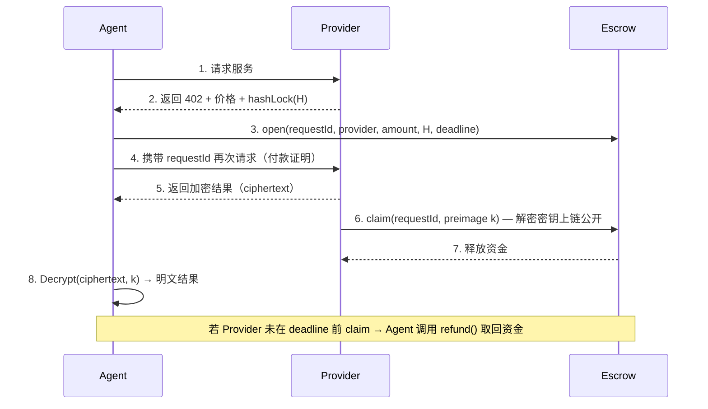

# NeuroStream

**Agent-native 付费与结算协议层。** 让 AI Agent 在运行时自动发现服务、执行链上付费、获取加密内容——全程无需信任，密码学保障交付。

> NeuroStream 通过 Escrow + Hashlock/Timelock 将资金释放与内容交付强绑定，彻底消除 Agent 自动付费时"付了钱拿不到结果"的风险。

## 解决的问题

AI Agent 在运行时调用外部付费服务，传统支付流程依赖信任——付款后无法保证收到合法结果。NeuroStream 用链上 Escrow + 密码学证明替代信任，实现**付费即交付、不交付即退款**。

## 协议流程



**核心保障：**

- **Agent 保护** — 资金锁定在 Escrow 合约中，不直接发送给 Provider。未交付则超时自动退款。
- **Provider 保护** — Provider 一旦上链公开 preimage（解密密钥），资金原子性释放，不可逆。
- **零信任** — Hashlock 机制确保付费与交付密码学绑定，双方均无法作弊。

## 技术栈

| 层级 | 技术 | 用途 |
|------|------|------|
| 智能合约 | Solidity + Hardhat | Escrow（Hashlock/Timelock） |
| 目标链 | Monad Testnet | 10,000+ TPS，1 秒确定性 |
| SDK | TypeScript（Viem） | Agent 端付费流程编排 |
| 索引器 | viem + Supabase 轮询索引器 | 链上事件索引至 PostgreSQL |
| 后端 | Supabase（Edge Functions + PostgreSQL） | 服务注册、质量指标 |
| 前端 | Next.js + Privy + Wagmi + shadcn/ui | Provider 管理面板 & Agent 控制台 |

## 项目结构

```
packages/
  contracts/     Escrow 智能合约（Solidity + Hardhat，18 个测试）
  sdk/           TypeScript SDK，Agent 开发者使用（26 个测试）
  indexer/       viem + Supabase 链上事件轮询索引器（7 个测试）
apps/
  frontend/      Next.js DApp — 服务发现、Agent 与 Provider 面板
  provider/      Provider API 服务，含 402 挑战流程（5 个测试）
  agent/         AI Agent CLI — Gemini + NeuroStream 自主付费对话
  backend/       Supabase Edge Functions + 数据库迁移
scripts/
  demo-flow.ts       本地演示（Hardhat 节点）
  demo-api-flow.ts   API 演示
  db-migrate.ts      数据库迁移脚本
```

## 快速开始

### 前置条件

- **Node.js** >= 18
- **pnpm** >= 8.14

### 1. 安装依赖

```bash
git clone https://github.com/user/neuro-stream-demo.git
cd neuro-stream-demo
pnpm install
```

### 2. 部署合约（本地开发）

Indexer 和 Provider 都依赖合约地址，因此需要先部署合约：

```bash
# 终端 1：启动本地 Hardhat 节点
cd packages/contracts && npx hardhat node

# 终端 2：部署 Escrow 合约
cd packages/contracts && npx hardhat run scripts/deploy.ts --network localhost
```

部署成功后会输出合约地址，例如 `0x5FbDB2315678afecb367f032d93F642f64180aa3`。

### 3. 配置环境变量

项目使用 `dotenv-cli -c` cascade 模式统一管理环境变量，加载顺序：

```
.env → .env.local → .env.<environment> → .env.<environment>.local
```

后加载的文件覆盖先加载的值。

| 文件 | 提交到 Git | 用途 |
|------|:----------:|------|
| `.env` | **是** | 共享非敏感默认值（端口号等） |
| `.env.development` | **是** | 开发环境默认值（本地 URL、测试地址） |
| `.env.production` | **是** | 生产环境模板（空占位符） |
| `.env.example` | **是** | 完整变量参考文档 |
| `.env.local` | 否 | 本地敏感信息（私钥、API Key） |
| `.env.development.local` | 否 | 开发环境本地覆盖 |
| `.env.production.local` | 否 | 生产环境本地覆盖 |

**快速开始：**

```bash
cp .env.example .env.local
```

将上一步获得的合约地址填入 `ESCROW_CONTRACT_ADDRESS`，其余变量按需填写：

| 变量 | 必填 | 说明 |
|------|:----:|------|
| `ESCROW_CONTRACT_ADDRESS` | **是** | 已部署的 Escrow 合约地址（本地开发必填） |
| `MONAD_RPC_URL` | 否 | Monad Testnet RPC 地址（部署到测试网时需要） |
| `DEPLOYER_PRIVATE_KEY` | 否 | 部署钱包私钥（部署到测试网时需要） |
| `PROVIDER_WALLET_ADDRESS` | 否 | Provider 钱包地址 |
| `PROVIDER_PRIVATE_KEY` | 否 | Provider 钱包私钥 |
| `SUPABASE_URL` | 否 | Supabase 项目 URL |
| `SUPABASE_ANON_KEY` | 否 | Supabase 匿名密钥 |
| `SUPABASE_SERVICE_ROLE_KEY` | 否 | Supabase Service Role 密钥 |
| `SUPABASE_DB_URL` | 否 | Supabase PostgreSQL 连接串（运行迁移时需要） |
| `PRIVY_APP_ID` | 否 | Privy 应用 ID |
| `PRIVY_APP_SECRET` | 否 | Privy 应用密钥 |
| `GEMINI_API_KEY` | 否 | Google Gemini API Key（Agent CLI 需要） |
| `NEUROSTREAM_API_URL` | 否 | NeuroStream Edge Functions URL |
| `NEUROSTREAM_API_KEY` | 否 | NeuroStream API Key（SDK 认证） |

### 4. 启动开发服务

```bash
# 确保 Hardhat 节点仍在运行，然后启动所有服务
pnpm dev
```

### 常用命令

```bash
pnpm dev          # 启动所有服务（Turborepo）
pnpm test         # 运行全部测试（共 54 个）
pnpm build        # 构建所有包
pnpm demo         # 运行本地 Demo（需先完成上述步骤 2-3）
pnpm db:migrate   # 执行 Supabase 数据库迁移（需要 DATABASE_URL）
```

## SDK 使用示例

```typescript
import { NeuroStream } from '@neurostream/sdk';

const client = new NeuroStream({
  apiKey: 'ns_live_xxxx',    // 平台注册后获取
  privateKey: '0x...',       // Privy 导出的钱包私钥
});

// Layer 1: 自动发现 + 选最优 + 自动付费调用
const { result } = await client.callService({
  keyword: 'text-analysis',
  params: { text: 'Hello world' },
});

// Layer 2: 指定 serviceId + 自动付费调用
const { result: r2 } = await client.callService({
  serviceId: 'text-analysis-v1',
  params: { text: 'Hello world' },
});

// Layer 3: 直接传 endpoint（高级用户）
const { result: r3, requestId } = await client.invokeService(
  'https://provider.example.com/invoke',
  { text: 'Hello world' }
);
```

SDK 自动编排完整流程：获取付费挑战（402）→ Escrow 锁款 → 接收加密内容 → 监听链上 claim → 解密返回。

## AI Agent CLI

`apps/agent/` 是一个完整的 AI Agent 应用：使用 Gemini 作为大脑，NeuroStream SDK 作为付费工具，通过终端交互式对话演示"AI Agent 自主付费调用链上服务"。

```
User 输入 → NeuroStream invokeService（链上 Escrow 付费） → Gemini 生成回复 → 终端显示
```

### 启动 Agent

```bash
# 1. 确保 .env.local 中配置了 GEMINI_API_KEY 和 ESCROW_CONTRACT_ADDRESS
# 2. Hardhat 节点运行中，合约已部署，Provider 服务运行中
# 3. 启动（pnpm dev 会自动启动所有 apps，包括 agent）
pnpm dev
```

### Agent 命令

| 命令 | 说明 |
|------|------|
| `/help` | 显示帮助信息 |
| `/balance` | 查看当前钱包余额 |
| `/quit` | 退出 Agent |
| 任意文本 | 付费调用 NeuroStream → Gemini 生成回复 |

每次用户输入，Agent 自动完成：
1. 调用 NeuroStream `invokeService()`（5 步 Escrow 流程，支付 0.001 ETH）
2. 将链上服务返回的结果传给 Gemini，生成智能回复
3. 在终端显示付款信息（requestId、费用、延迟）+ AI 回复

## 智能合约

`Escrow` 合约（`packages/contracts/contracts/Escrow.sol`）提供三个核心函数：

| 函数 | 说明 |
|------|------|
| `open(requestId, provider, hashLock, deadline)` | 锁定资金。Agent 调用。 |
| `claim(requestId, preimage)` | 提交 preimage 领取资金。Provider 调用。 |
| `refund(requestId)` | 超时退款。Provider 未交付时 Agent 调用。 |

链上事件（`PaymentLocked`、`PaymentReleased`、`PaymentRefunded`）作为可验证收据，由 viem 轮询索引器实时索引至 Supabase `payments` 表供查询。

## 索引器

`packages/indexer/` 是一个轻量级链上事件索引服务，替代了原来的 Envio HyperIndex。

**架构**：使用 viem `getLogs` 按区块轮询 Escrow 合约事件，解析后写入 Supabase PostgreSQL。

| 组件 | 说明 |
|------|------|
| `payments` 表 | 存储 PaymentLocked / Released / Refunded 事件数据 |
| `indexer_state` 表 | 区块游标（单行），崩溃恢复用 |
| 轮询间隔 | 默认 3 秒，可通过 `INDEXER_POLL_INTERVAL_MS` 配置 |

**单独启动索引器**：

```bash
# 需要设置 MONAD_RPC_URL, ESCROW_CONTRACT_ADDRESS, SUPABASE_URL, SUPABASE_SERVICE_ROLE_KEY
cd packages/indexer && pnpm start
```

**数据库迁移**：

```bash
# 需要在 .env.local 中配置 SUPABASE_DB_URL
# 从 Supabase Dashboard → Settings → Database → Connection string → URI 复制
pnpm db:migrate
```

## 测试

```bash
# 全部测试（共 57 个）
pnpm test

# 仅合约测试（18 个）
cd packages/contracts && npx hardhat test

# 仅 SDK 测试（26 个）
cd packages/sdk && pnpm test

# 仅 Provider 测试（5 个）
cd apps/provider && pnpm test

# 仅 Indexer 测试（7 个）
cd packages/indexer && pnpm test

# E2E 集成测试（1 个，需要运行中的 Hardhat 节点）
cd e2e && pnpm test
```

## 文档

- [产品需求文档](memory-bank/prd.md)
- [架构设计](memory-bank/architecture.md)
- [实施计划](memory-bank/implementation-plan.md)
- [技术栈](memory-bank/tech-stack.md)
- [开发进度](memory-bank/progress.md)

## License

MIT
