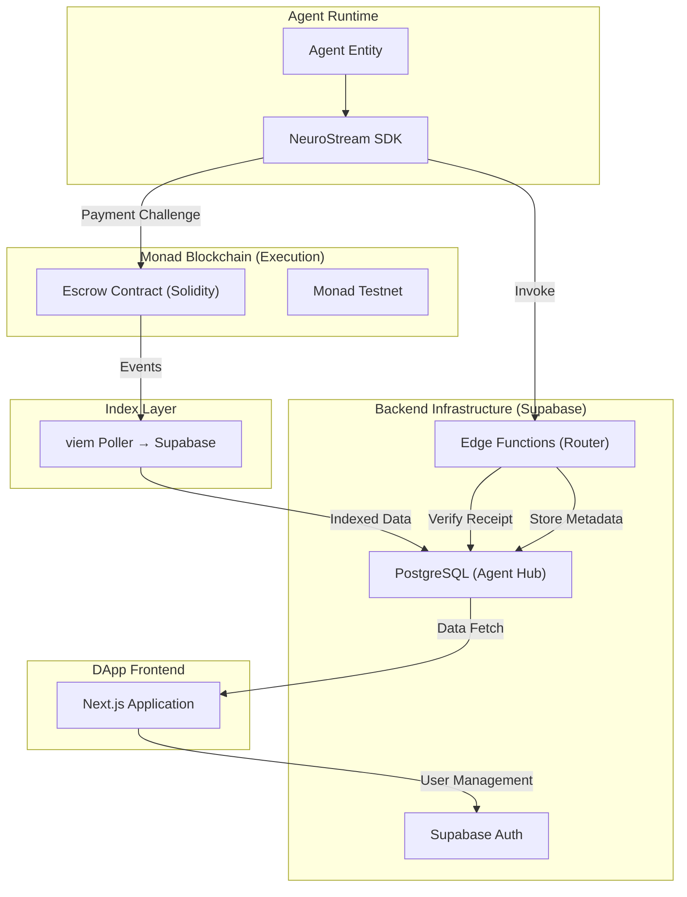

# NeuroStream 架构设计

## 1. 系统概览
NeuroStream 采用分层结构，实现 Agent 支付、合约结算与数据索引的解耦。

## 2. 核心架构图 (Architecture Diagram)

## 3. 组件职责

### 3.1 Escrow Contract (Monad)
*   负责资金锁定 (Lock) 与释放 (Claim)。
*   通过 `Hashlock` 确保交付后再打款。
*   提供超时自动退款机制。

### 3.2 viem + Supabase Indexer (Index Layer)
*   使用 viem `getLogs` 轮询链上 `PaymentLocked`、`PaymentReleased` 和 `PaymentRefunded` 事件。
*   将事件数据写入 Supabase PostgreSQL `payments` 表。
*   `indexer_state` 表存储区块游标，支持崩溃恢复。
*   轮询间隔可配置（默认 3 秒）。

### 3.3 Supabase (Backend Layer)
*   **Edge Functions**: 作为服务的中央网关，验证链上 Receipt 的真实性，并转发请求至 Provider。
*   **PostgreSQL**: 存储 Provider 的评分、质量指标，以及由索引器写入的链上支付数据。

### 3.4 Next.js (Frontend Layer)
*   Provider 的管理面板：发布 Service Manifest。
*   Agent 所有者的控制台：监控支付历史与额度。

## 4. 关键流程：合约与索引的闭环

1.  **支付阶段**: Agent 在 Monad 链上调用 `Escrow.open()`。
2.  **索引阶段**: viem 轮询索引器数秒内捕获事件并写入 Supabase `payments` 表。
3.  **调用阶段**: Supabase Edge Function 查询 `payments` 表，确认资金已就位，随即放行请求。
4.  **结算阶段**: Provider 完成交付并调用 `Escrow.claim()`。
