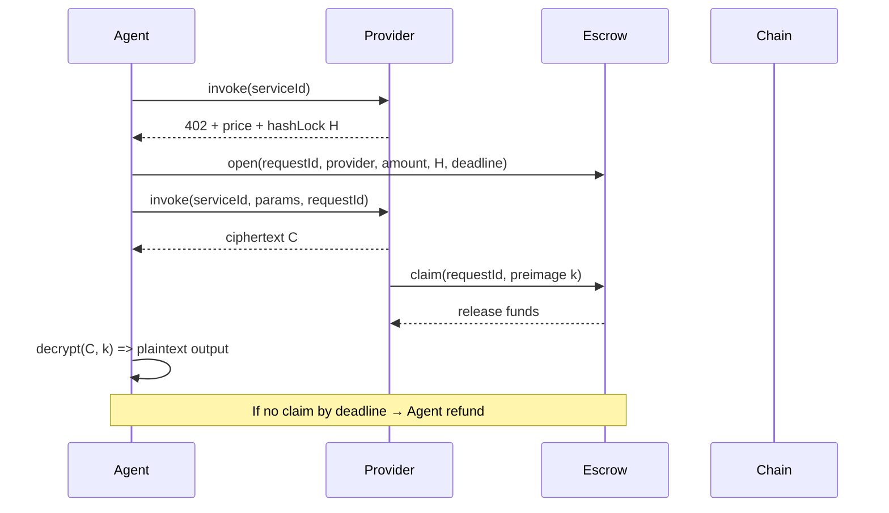

# 📌 NeuroStream 产品需求文档（核心精炼版）

> **目标**：让 Agent 运行时自动进行按次付费调用服务，并保证付费后一定能拿到合法内容或者退款，同时提供质量指标用于优选服务。

---

## 🧠 1. 产品定位（What）

**NeuroStream 是一个协议化的 Agent‑native 付费与结算能力层**：
它让 Agent 在运行时能够自动发现服务、执行链上付费（带交付保障），获取可验证 receipt，并通过调用质量指标帮助优选可信服务。

---

## 🎯 2. 核心问题与解决方案（Why）

### 问题

1. Agent 付费调用服务时，如何避免付费后拿不到合法结果？
2. 如何让 Agent 自动化完成付费流程？
3. 如何让付费行为具可验证的链上 evidence？
4. 如何衡量服务是否可信/可用？

### 解决方案

* **协议化付费 + Escrow 交付保证**：把交付合法性与资金释放执行强绑定
* **自动化付费机制**：Agent 不需要账户体系，只通过协议自动完成
* **链上 receipt**：链上事件证明支付与交付完成
* **质量指标体系**：自动收集调用行为指标，用于服务排序与优选

---

## 🧩 3. 核心功能（What）

1. **服务发现（Discovery）**

   * 提供 Manifest fetch 或搜索接口
   * 支持关键词/类型的服务查找

2. **协议化付费（Automatic Payment）**

   * 标准 Payment Challenge 输出
   * 自动锁款到 Escrow

3. **交付保证机制（Delivery Guarantee）**

   * Escrow + Hashlock/Timelock 绑定付费与交付
   * Provider 只有实际交付才能拿钱

4. **验证与转发（Proof & Forward）**

   * 验证链上支付凭证后才放行请求

5. **质量指标体系（Quality Metrics）**

   * 自动采集成功率/延迟/schema match 用于排序

---

## 🧠 4. 核心协议设计（How）

### 4.1 Manifest（Provider 服务定义）

Provider 发布一个 JSON Manifest：

```json
{
  "serviceId":"web.summarize",
  "endpoint":"https://provider/api/summarize",
  "pricing":{"model":"per_call","asset":"ETH","amount":"0.01"},
  "recipient":"0xabcd1234...",
  "schema":{"input":"url","output":"summary"}
}
```

目的：

* 描述调用方式
* 提供计费信息
* 用于 discovery 与 invoking

---

### 4.2 Escrow 交付保证机制

**核心目标**：资金释放和内容交付强绑定

#### 🪙 1) 锁定资金（Escrow）

Agent 在收到 Payment Challenge 和 hashLock (`H`) 后：

```solidity
open(requestId, provider, amount, H, deadline);
```

参数：

* `requestId`：本次调用唯一 ID
* `provider`：Provider 钱包
* `amount`：锁定金额
* `H`：Hash(k)
* `deadline`：Provider 必须交付解密 key 的截止时间

此时资金锁定在合约中，不直接发送给 Provider。

---

#### 🔒 2) Provider 返回 ciphertext

Provider 使用随机 key `k` 生成：

```
ciphertext = Enc(plaintext, k)
```

并返回给 Agent。

---

#### 🔓 3) Provider 提供解密 Key

Provider 提供 preimage `k`：

```solidity
claim(requestId, preimage);
```

合同检查：

```
Hash(preimage) == stored H
```

成功则释放资金给 Provider。

---

#### 💸 4) 超时退款

超过 `deadline` 未提供 preimage：

```solidity
refund(requestId);
```

资金退回 Agent。

---

### 4.3 Payment Challenge（协议化付费）

服务返回：

```json
{
  "amount":"0.01",
  "asset":"ETH",
  "recipient":"0xabcd1234...",
  "nonce":"0xdeadbeef",
  "deadline":1700000000
}
```

Agent 用此挑战构造 Escrow.lock。

---

### 4.4 Chain Receipt（链上凭证）

成功释放资金后由 Escrow 合约触发：

```solidity
event PaymentReleased(
  bytes32 requestId,
  address provider,
  uint256 amount
);
```

这成为可链上验证的收据。

---

## 🔄 5. 核心流程（端到端）



---

## 💡 6. 接口与事件（核心）

### Escrow 合约最小接口

#### open

```solidity
function open(
    bytes32 requestId,
    address provider,
    uint256 amount,
    bytes32 hashLock,
    uint64 deadline
) external payable;
```

---

#### claim

```solidity
function claim(bytes32 requestId, bytes32 preimage) external;
```

---

#### refund

```solidity
function refund(bytes32 requestId) external;
```

---

### 链上事件（用于索引 & 收据）

```solidity
event PaymentLocked(bytes32 indexed requestId, address agent, address provider, uint256 amount, bytes32 hashLock, uint64 deadline);
```

```solidity
event PaymentReleased(bytes32 indexed requestId, address provider, uint256 amount);
```

```solidity
event PaymentRefunded(bytes32 indexed requestId, address agent, uint256 amount);
```

---

## 📊 7. 质量指标体系（Quality Metrics）

### 自动指标（Agent SDK 采集）

* successFlag（是否完成 Escrow + delivery）
* latency
* schemaMatch（返回结果是否符合 manifest schema）

### 聚合指标

```json
{
  "serviceId":"web.summarize",
  "successRate": 0.93,
  "avgLatency": 380,
  "schemaMatchRate": 0.88,
  "qualityScore": 0.89
}
```

### 排序逻辑

Search 优先使用：

```
qualityScore > successRate > lower price > avgLatency
```

---

## ⚡ 8. 核心风险 & 止损策略

| 风险                 | 对策                      |
| ------------------ | ----------------------- |
| Provider 不交付       | Escrow 超时 refund        |
| Provider 恶意不提供 key | Refund 保证               |
| Agent 重放/滥用        | nonce + requestId 保证无重复 |
| 价格突变/报价被锁死         | 支付挑战与 escrow 预约一致性      |

---

## 📌 9. 关键设计取舍（为评委说明）

| 设计点                    | 取舍理由          |
| ---------------------- | ------------- |
| 先 Escrow 锁款再交付 vs 直接支付 | 解决付费无返结果风险    |
| 加密交付 + Hashlock        | 资金与交付强绑定      |
| 自动化、无账户体系              | 最大化 Agent 可用性 |
| 自动质量指标                 | 替代传统星级评价      |
| 链上 Receipt             | 确保可审计证明       |

---

## 🧠 10. 赛道对齐与价值表达（一句话）

> **NeuroStream 是一个协议化付费与结算能力层，支持自动化 Escrow 保障付费后内容交付，并通过链上凭证 + 质量指标体系为 Agent 提供可信服务调用能力。**

---

## 📈 11. 是否引入这个新机制能改变原流程？

**是 — 但只改变支付部分的执行机制：**

* 原来是直接支付给 Provider
* 现在是先 Escrow 锁款再交付验证后释放
* 保证 Agent 资金安全与交付完整

其他 discovery/quality/system 模块逻辑不变。

---

## 🏁 12. 核心验收标准（用于 Demo/评审）

| 验收点                 | 验证方式                    |
| ------------------- | ----------------------- |
| 402 Challenge 输出    | 402 + price + hashLock  |
| Escrow Lock         | `PaymentLocked` event   |
| Provider ciphertext | ciphertext 可被 Agent 获取  |
| Provider claim      | `PaymentReleased` event |
| Agent 成功解密          | 明文输出可验证                 |
| 超时 refund           | `PaymentRefunded` event |

---

## 🔚 一句话总结

> **NeuroStream 通过 Escrow + Hashlock/Timelock 强制绑定资金与内容交付，使得 Agent 在自动付费调用服务时不再有“付费丢钱/无交付”的风险，并以链上凭证 + 服务质量指标支持可信调用。**

---