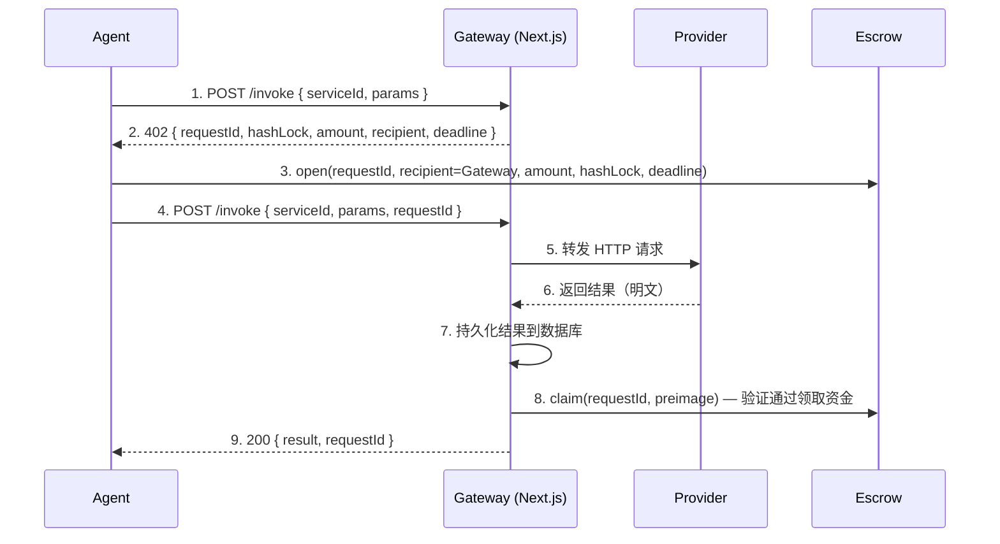

# NeuroStream 智流

**Agent-native 付费与结算协议层。**

> NeuroStream 是一个让 AI Agent 在运行时自动发现服务、通过 Payment Gateway 执行链上付费、获取服务结果的底层协议网络。平台提供 Escrow 担保交付，资金安全有保障。Provider 只需提供普通 HTTP API，零区块链集成门槛；Agent 付费即交付、不交付即退款。

---

## 一、 项目定位与解决的痛点

在当前的 AI Agent 生态中，智能体极具行动力，却跑不通“花钱买服务”的最后一公里：
AI Agent 在运行时调用外部付费服务，传统支付流程依赖受托的信任——付款后无法保证收到合法结果。NeuroStream 用 **Payment Gateway + 链上 Escrow** 替代信任：

- **Agent 保护** — 资金锁定在智能合约中，未成功交付则超时自动退款。
- **Provider 保护** — 提供商结果先安全持久化到数据库，再执行链上 claim（认领资金），发包即收款，恢复任务自动重试。
- **零门槛接入** — Web2 服务提供商只需提普通 HTTP API（RESTful 接口），完全无需维护钱包/私钥/区块链集成节点即可赚钱。

---

## 二、 核心架构与模块说明

本项目为一个功能极其完整的 Monorepo 基础设施，包含从智能合约端到 Agent 终端的各个分层：

```text
packages/
  contracts/     Escrow 智能合约（Solidity + Hardhat，保障资金安全隔离）
  sdk/           TypeScript SDK，Agent 开发者使用，一行代码自动鉴权锁资扣费
  indexer/       viem + Supabase 链上事件轮询索引器
apps/
  frontend/      Next.js DApp + Payment Gateway API Route（Web2 控制面板）
  provider/      Provider API 服务，纯 HTTP 接口模拟服务方
  agent/         AI Agent CLI — 基于 Gemini 大脑的自动化付费终端
  backend/       Supabase Edge Functions 后端支持
```

---

## 三、 协议核心流程解析

网关设计完全受 HTTP 402 (Payment Required) 协议启发。桥接了链上操作和 HTTP API 调用：



**双端核心不变量（Invariants）保障：**
1. **Agent 的资金保障** — 如果 Agent 锁定了链上资金（USDC 等代币），它必须得到服务结果，否则在 deadline 过后必将退款。
2. **Provider 的回款保障** — 如果 Provider 返回了结果且已成功持久化，Gateway 最终一定会代为触发支付认领交易。即使网络宕机，状态机恢复任务也会每 30s 自动推进卡住的支付队列。

---

## 四、 技术栈大盘点

| 技术层级 | 框架与工具 | 用途说明 |
|------|------|------|
| **智能合约** | Solidity + Hardhat | Web3 层的 Escrow 资金托管及发卡状态管理。 |
| **目标公链** | Monad Testnet | 利用其 10,000+ TPS 与 1 秒绝对确定性，实现高频无感划扣。 |
| **支付网关** | Next.js API Route | 路由分发、中转付费 402 拦截、防作恶验证与故障恢复调度。 |
| **快速开发 SDK** | TypeScript（基于 Viem）| 为主流 Agent 框架准备，屏蔽链上细节。 |
| **状态索引** | viem + Supabase 轮询触发器 | 全自动链上事件监听到 PostgreSQL 的毫秒级存储更新。 |
| **服务中心台** | Next.js + Privy + Wagmi + shadcn/ui | 提供 Web2 用户友好的门户管理面板。 |

---

## 五、 安装与运行步骤 (快速验证指南)

以下为您展示如何在本地极速拉起本项目全链路核心并进行测试（v3 / v4 Gateway 架构）：

### 1. 前置环境与依赖安装
- **环境**：Node.js >= 18, pnpm >= 8.14
- **克隆并装包**：
```bash
git clone https://github.com/ccclucky/neuro-stream.git
cd neuro-stream-demo
pnpm install
```

### 2. 部署本地区块链合约节点
```bash
# 终端 1：启动本地 Hardhat 高性能节点
cd packages/contracts && npx hardhat node

# 终端 2：在新端口部署 Escrow 担保合约
cd packages/contracts && npx hardhat run scripts/deploy.ts --network localhost
```
*(部署成功后控制台会安全输出 ERC20 及 Escrow 合约地址)*

### 3. 环境配置与系统初始化
通过拷贝示例快速配置环境，并将上一步部署的合法 `ESCROW_CONTRACT_ADDRESS` 填入 `.env.local` 即可：
```bash
cp .env.example .env.local

# 重置后端与 Supabase 数据库表状态
pnpm db:reset  
```

### 4. 体验全栈运行闭环
```bash
# 自动拉起全部 Turborepo 包：Frontend、Gateway中枢、Indexer索引以及 Provider
pnpm dev
```

打开 `apps/agent` 启动交互式终端测试：
Agent 程序是一个集成了 NeuroStream SDK 与 Google Gemini API 的大脑实体。
在命令行内告诉它：“**请利用外部文本处理服务帮我分析这段话**”，终端将实况演示：
`发起意图 -> 402拦截 -> 授权付账 -> Provider提供服务 -> 得到结果并销账` 的全自动化零等待微支付过程。

---

## 六、 作者与代码许可协议

- **仓库展示**：请查看我们的公开 Github。
- **开源协议**：本项目基于 MIT License 完全开源。
- **关于我们**：智流网络（NeuroStream）致力于在 AGI 到来的前夜，补齐机器之间交互缺乏信赖及底层计费媒介的历史鸿沟。
